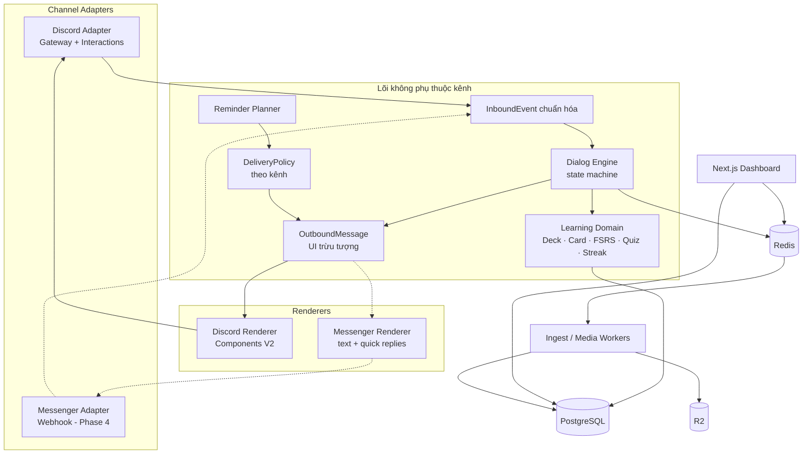
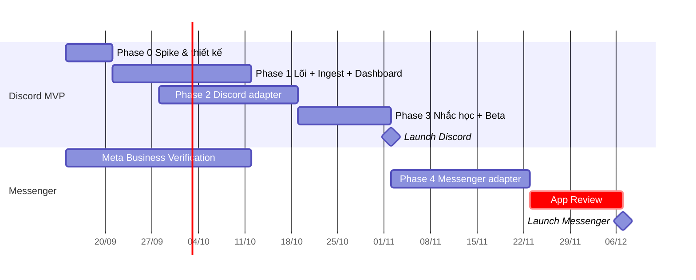

# PLAN v3 — HanziDaily: Chatbot học tiếng Trung (Discord trước, Messenger sau)

> Phiên bản: **3.0 (Discord-first, kiến trúc đa kênh)** · Ngày: 10/09/2026
> Quy mô: MVP < 1.000 người dùng/tháng · Techstack: Node.js / TypeScript · Team giả định: 2 dev fullstack
> Tên dự án: **HanziDaily** · Repo: `hanzi-daily` · Package scope: `@hanzi-daily/*`
> Tham khảo ý tưởng: [ViqiumAI](https://github.com/quocbahuynh/ViqiumAI)
> Lịch sử: v1 (Messenger + Fanpage) → v2 (review tính khả thi) → **v3 (làm Discord trước, thiết kế sẵn để thêm Messenger)**

---

## 0. Review tính khả thi khi chuyển sang Discord

### 0.1 Kết luận

**Làm Discord trước là KHẢ THI và RỦI RO THẤP HƠN hẳn** so với làm Messenger trước. Có một đánh đổi quan trọng về **thị trường**, xem ghi chú bên dưới.

| Tiêu chí | Discord | Messenger | Ảnh hưởng tới dự án |
|---|---|---|---|
| Nhắn chủ động (nhắc học hằng ngày) | ✅ Được, nếu người dùng **đồng ý (opt-in)** và bot DM được họ (cần chung server hoặc có quyền phù hợp) | ⚠️ Chỉ trong **24h** sau lần tương tác cuối. Gói trả phí thay thế chưa rõ có ở VN | Giải được rủi ro lớn nhất của v2 |
| Phải xin duyệt trước khi ra mắt | ✅ Không cần duyệt với quy mô MVP. Privileged intent chỉ phải xét duyệt khi app đạt **10.000 user** (quy định mới từ 06/2026) | 🔴 App Review + Business Verification, mất vài tuần | Ra mắt sớm hơn khoảng 3–4 tuần, beta mở được ngay |
| Giao diện trong chat | ✅ Rất phong phú: **sửa tin nhắn tại chỗ** (lật thẻ không sinh tin mới), 5 nút/hàng, select 25 lựa chọn, **modal nhập text và upload file**, tin nhắn chỉ mình người dùng thấy (ephemeral), autocomplete, audio phát ngay trong chat | ⚠️ Quick reply biến mất sau khi bấm, không sửa được tin đã gửi | Flashcard **làm được ngay trong chat**, MVP không cần trang học web riêng |
| Định danh người dùng | ✅ Đăng nhập Discord OAuth2 trên dashboard trả về **đúng ID mà bot thấy**, không cần liên kết | ⚠️ PSID ≠ ASID, phải liên kết bằng `ref` | Bớt một luồng phức tạp |
| Chi phí API | Miễn phí | Miễn phí (Marketing Messages trả phí) | Như nhau |
| Vận hành | Cần tiến trình **Gateway WebSocket** chạy liên tục | Webhook HTTP | Chênh lệch nhỏ |
| **Độ phủ người dùng Việt Nam** | ⚠️ **Nhỏ hơn nhiều**, chủ yếu Gen Z, game thủ, cộng đồng online | ✅ Rất lớn, đa số người học tiếng Trung ở VN dùng FB/Zalo | 🔴 **Rủi ro sản phẩm**: Discord hợp để pilot và xây cộng đồng, chưa phải kênh tiếp cận đại chúng |

**Khuyến nghị:** dùng Discord làm **kênh pilot**: kiểm chứng sản phẩm (chất lượng AI, vòng lặp học hằng ngày, retention) nhanh và rẻ. Kiến trúc được thiết kế **không phụ thuộc kênh** ngay từ đầu, để khi thêm Messenger chỉ cần viết **adapter** (khoảng 3–4 tuần dev + thời gian Meta duyệt), không phải viết lại lõi.

### 0.2 Những gì thay đổi so với v2

| # | Thay đổi | Lý do |
|---|---|---|
| 1 | Kênh MVP: **Discord** (DM + server cộng đồng). Messenger chuyển sang Phase 4 | Bỏ được 2 rủi ro đỏ (cửa sổ 24h, App Review) |
| 2 | Thêm **Channel Adapter layer** (kiến trúc hexagonal): lõi học tập không import `discord.js` | Đảm bảo thêm Messenger về sau không phải refactor |
| 3 | UI thiết kế theo **mẫu số chung nhỏ nhất** giữa các kênh (≤ 4 lựa chọn, nhãn ≤ 20 ký tự, payload ≤ 100 ký tự) | Mọi luồng hội thoại chạy được trên cả hai kênh |
| 4 | Bảng `MessengerProfile` → **`ChannelIdentity`**, bảng `Page` → **`ChannelScope`** (guild/page) | Dữ liệu đa kênh, 1 user có nhiều kênh |
| 5 | Nhắc học đi qua **`DeliveryPolicy` theo từng kênh** (Discord: tự do có opt-in; Messenger: quy tắc 24h của v2) | Thuật toán 24h của v2 được giữ lại, cắm vào khi thêm Messenger |
| 6 | Dashboard đăng nhập bằng **Discord OAuth2** (thêm Facebook Login ở Phase 4) | Tự liên kết danh tính |
| 7 | Trang học web mobile **lùi sang Phase 4** (Discord lật thẻ tại chỗ được) | Giảm scope MVP |
| 8 | Fanpage → **server Discord cộng đồng** (kênh #từ-vựng-mỗi-ngày, bảng xếp hạng tuần) trong giai đoạn đầu | Tăng trưởng mà không cần quyền Page |
| 9 | Upload tài liệu **ngay trong Discord** (option attachment của `/upload` hoặc modal File Upload) **và** trên dashboard | Tiện hơn. Duyệt thẻ vẫn làm trên dashboard |
| 10 | Timeline MVP: **7 tuần** (v2: 9–10 tuần). Messenger live khoảng **tuần 12–13** | Không phải chờ Meta duyệt ở đường găng |

### 0.3 Rủi ro riêng của Discord (và cách xử lý)
- **Bot không DM được user** (user tắt “DM từ thành viên server”, không còn server chung, hoặc đã chặn app. Lỗi `50007` = chặn app, `50278` = không gửi được). → Onboarding hướng dẫn bật DM. Nếu vẫn lỗi thì đánh dấu `canDM=false`, nhắc bằng **mention trong kênh riêng hoặc private thread** ở server cộng đồng, hoặc qua email.
- **Chính sách Discord:** cấm DM không được phép (**chỉ nhắc khi user đã opt-in**, luôn có `/nhac tat`). **Cấm dùng nội dung tin nhắn lấy từ API để train AI/LLM.** Dữ liệu chỉ được dùng cho đúng chức năng app đã công bố. → Chỉ gửi nội dung cho LLM để phục vụ chính người dùng đó; chọn nhà cung cấp/cấu hình **không dùng dữ liệu để train**.
- **DM chủ động qua user-install (không chung server):** hành vi chưa rõ ràng → **spike ở Phase 0**. Mặc định: yêu cầu user vào **server cộng đồng chính thức** để đảm bảo DM được.
- **Interaction phải phản hồi trong 3 giây** → với tác vụ AI: `deferReply` rồi gửi followup (token interaction còn hiệu lực 15 phút). Tác vụ dài hơn thì báo kết quả bằng DM mới.
- **Giới hạn số server khi chưa verify app:** MVP chủ yếu dùng DM + 1 server cộng đồng nên không bị ảnh hưởng. Khi mở cho nhiều server (giáo viên/lớp học) thì làm App Verification.

---

## 1. Tổng quan sản phẩm

Người học upload tài liệu tiếng Trung (qua **Dashboard web** hoặc **ngay trong Discord**). AI chuyển thành **bộ flashcard nháp** (Hán tự, pinyin, Hán Việt, nghĩa tiếng Việt, ví dụ, audio) để người học **duyệt trên Dashboard**. Mỗi ngày bot **DM nhắc học**, người học **lật thẻ và làm quiz ngay trong Discord**. Lịch ôn tính bằng **FSRS**. Về sau thêm **Messenger** mà dùng lại toàn bộ lõi.

| Thành phần | Vai trò |
|---|---|
| **Discord bot** (kênh MVP) | Slash commands, flashcard lật tại chỗ, quiz, tra từ, nhắc học qua DM, upload nhanh |
| **Server Discord cộng đồng** | Onboarding, bảo đảm DM được, #từ-vựng-mỗi-ngày, bảng xếp hạng tuần, hỗ trợ |
| **Web Dashboard** | Đăng nhập Discord, upload, **duyệt/sửa thẻ**, quản lý deck, cài đặt, thống kê |
| **Messenger + Fanpage** (Phase 4) | Adapter mới cắm vào cùng lõi, kèm trang học web mobile và quy tắc 24h |

### 1.1 Luồng người dùng (Discord)

```mermaid
flowchart LR
    A[Link mời / QR / cộng đồng] --> B[Vào server cộng đồng<br/>bot chào + hướng dẫn bật DM]
    B --> C["/start → tạo account theo Discord ID"]
    C --> D[Học ngay deck HSK có sẵn]
    D --> E["/upload hoặc Dashboard: upload tài liệu"]
    E --> F[AI tạo thẻ nháp]
    F --> G[Duyệt & publish trên Dashboard<br/>đăng nhập Discord OAuth]
    G --> H[Mỗi ngày: DM nhắc học]
    H --> I["/hoc: lật thẻ tại chỗ · /quiz"]
    I --> H
```



---

## 2. Phạm vi

### 2.1 MVP (Discord) — CÓ làm
- **Slash commands:** `/start`, `/hoc` (flashcard), `/quiz`, `/tra <từ>` (có autocomplete), `/upload` (đính kèm file), `/deck` (chọn deck), `/tiendo`, `/caidat` (giờ nhắc, số thẻ/ngày), `/nhac bat|tat`, `/xoadulieu`.
- **Flashcard tại chỗ:** 1 tin nhắn duy nhất. Bấm “Lật” thì **sửa tin** hiện mặt sau. Đánh giá 4 nút FSRS (Quên/Khó/Nhớ/Dễ). Nút `🔊` gửi audio.
- **Quiz:** chọn nghĩa, chọn pinyin, chọn chữ Hán, nghe → chọn từ (≤ 4 đáp án), **điền từ bằng modal** nhập text.
- **Nhắc học qua DM** (opt-in) + fallback mention trong server + email (tùy chọn).
- **Server cộng đồng:** bot tự đăng #từ-vựng-mỗi-ngày, bảng xếp hạng streak/điểm theo tuần.
- **Dashboard:** đăng nhập Discord OAuth2, upload, AI trích xuất (3 chế độ, chi tiết ở v2), duyệt/sửa thẻ, deck, cài đặt, thống kê.
- Deck HSK 1–3 có sẵn, TTS có cache, hạn mức AI, `AiUsage`.
- Tuân thủ: Terms, Privacy Policy (bắt buộc cho app), đồng ý xử lý dữ liệu, xóa dữ liệu.

### 2.2 KHÔNG làm trong MVP
Messenger/Fanpage (Phase 4) · trang học web mobile (Phase 4) · Discord Activity (app nhúng trong Discord) · chấm câu dịch bằng AI · RAG hỏi đáp tài liệu · voice/phát âm · Anki import/export · phồn thể, HSK 4–6 · multi-tenant cho giáo viên · thanh toán.

---

## 3. Techstack

> 📄 Chi tiết đầy đủ (version, lý do chọn, cấu hình, queue, CI/CD, docker-compose, env, rủi ro tương thích): xem **[TECHSTACK.md](./TECHSTACK.md)**.

| Lớp | Công nghệ (version khởi đầu, 09/2026) | Ghi chú |
|---|---|---|
| Runtime / ngôn ngữ | Node.js 24 LTS · TypeScript 6.0 (thử TS 7 native ở Phase 0) | NestJS build bằng SWC |
| Monorepo & tooling | pnpm 12 · Turborepo 2.10 · Biome 2.5 · **dependency-cruiser** | Chặn lõi import SDK của kênh (mục 4.3) |
| apps/web | Next.js 16.3 (App Router, Server Actions) · React 19 · Tailwind 4 · shadcn/ui · TanStack Table/Query | Dashboard. Phase 4 thêm `/study` |
| Auth | Better Auth 1.7: **Discord OAuth2**, magic link. Facebook ở Phase 4 | ID Discord trùng với ID bot thấy |
| apps/bot | NestJS 12 + **discord.js 14.27** (Components V2), **không dùng Necord** | Gateway, luôn đúng 1 instance |
| apps/worker | NestJS 12 (application context) + BullMQ 6 | Ingest, media, planner. Scale riêng |
| Channel adapters | `packages/channel-discord` (MVP), `packages/channel-messenger` (Phase 4) | TS thuần, không phụ thuộc Nest |
| Database | PostgreSQL 18 + Prisma 7.10 (`@prisma/adapter-pg`) · `pg_trgm`, `unaccent` (pgvector ở Phase 5) | Không dùng Prisma 8 RC |
| Queue / State / Lock | Redis 8 (`noeviction`) + BullMQ OSS + khóa Redis theo `userId` | |
| Lưu file | Cloudflare R2 (S3 SDK, presigned) | Attachment Discord hết hạn, tải về ngay |
| LLM | Vercel AI SDK 7 + Zod 4. Model theo task (Haiku/Flash/mini), chọn bằng golden set | Không dùng dữ liệu để train |
| Eval & tracing | Langfuse (OTel SDK 5) | Gate chất lượng trong CI |
| Parse tài liệu | unpdf · mammoth · SheetJS CE (từ CDN, không dùng gói `xlsx` trên npm) · papaparse · sharp · file-type | Fallback Vision |
| Tiếng Trung | pinyin-pro · `Intl.Segmenter` · CVDICT · CC-CEDICT · HSK list | CC BY-SA 4.0, phải ghi nguồn |
| SRS / TTS / Email | ts-fsrs 5 · Azure Speech (dự phòng Google TTS) · Resend | Audio có cache |
| Hạ tầng | Docker Compose trên VPS Singapore 2 vCPU/4GB + Caddy · GHCR · GitHub Actions | Vercel Hobby không cho dùng thương mại |
| Giám sát & test | Sentry · pino · BetterStack · Bull Board · Vitest 5 · Testcontainers · Playwright | |

---

## 4. Kiến trúc đa kênh (trọng tâm của v3)

### 4.1 Sơ đồ



### 4.2 Các hợp đồng (interface) chính

```ts
// packages/channel-kit — KHÔNG phụ thuộc discord.js / Graph API
type Channel = 'discord' | 'messenger';

interface InboundEvent {
  channel: Channel;
  externalUserId: string;          // Discord user ID / Messenger PSID
  scopeId?: string;                // guildId / pageId
  kind: 'command' | 'action' | 'text' | 'attachment' | 'referral';
  command?: { name: string; args: Record<string, string> };
  action?: string;                 // payload đã mã hóa, ≤ 100 ký tự
  text?: string;
  attachments?: { url: string; mime: string; size: number }[];
  replyHandle: unknown;            // interaction / recipient, chỉ adapter hiểu
  receivedAt: Date;
}

type UiBlock =
  | { type: 'text'; text: string }                        // ≤ 2000 ký tự
  | { type: 'card'; title: string; body: string; fields?: [string, string][] }
  | { type: 'choices'; prompt?: string; options: { label: string; action: string }[] } // ≤ 4, nhãn ≤ 20
  | { type: 'audio'; mediaKey: string }
  | { type: 'link'; label: string; url: string }
  | { type: 'askText'; prompt: string; action: string };  // Discord: modal · Messenger: chờ tin text

interface OutboundMessage {
  blocks: UiBlock[];
  mode: 'new' | 'replace';        // replace = sửa tin trước (Discord); Messenger tự lùi về 'new'
  visibility: 'private' | 'public';// Discord: ephemeral trong server · DM luôn private
}

interface ChannelCapabilities {
  maxChoices: number; maxLabelLen: number; maxTextLen: number;
  canEditMessage: boolean; canEphemeral: boolean; hasModal: boolean;
}

interface DeliveryPolicy {                      // quy tắc gửi chủ động
  canSendProactive(identity: ChannelIdentity, now: Date): boolean;
  latestSendTime(identity: ChannelIdentity, now: Date): Date | null; // Messenger: lastInbound + 23h
}

interface ChannelAdapter {
  capabilities: ChannelCapabilities;
  policy: DeliveryPolicy;
  send(identity: ChannelIdentity, msg: OutboundMessage, replyHandle?: unknown): Promise<SendResult>;
}
```

- **Action codec** dùng chung: `v1|QZ|<attemptId>|<opt>`, `v1|FC|FLIP|<cardId>`, `v1|FC|RATE|<cardId>|<1-4>`. Luôn ≤ 100 ký tự (giới hạn `custom_id` của Discord, chặt hơn payload Messenger). Có version để đổi format mà không làm hỏng các nút cũ.
- **Dialog Engine** là hàm thuần: `(state, InboundEvent) → (newState, OutboundMessage[], domainEffects)` → test được bằng transcript, không cần Discord thật.

### 4.3 Luật bắt buộc để mở rộng được (guardrails)
1. `packages/core`, `packages/dialog` **không được import** `discord.js` hay client Graph API. Kiểm tra bằng dependency-cruiser trong CI.
2. Mọi luồng hội thoại thiết kế theo **mẫu số chung**: ≤ 4 lựa chọn/câu hỏi, nhãn nút ≤ 20 ký tự, text ≤ 2.000 ký tự. Không **bắt buộc** phải có edit/modal: engine đưa ra gợi ý (`replace`, `askText`), adapter nào không hỗ trợ thì lùi về cách đơn giản hơn.
3. **User không bao giờ được định danh bằng ID của kênh.** Mọi dữ liệu học gắn với `userId`. ID kênh chỉ nằm ở `ChannelIdentity`.
4. Mọi tin **chủ động** (nhắc học, thông báo xử lý xong) phải đi qua `DeliveryPolicy`.
5. Mỗi luồng có **transcript test** chạy qua renderer của từng kênh (snapshot). Khi thêm Messenger, bộ test này chính là checklist nghiệm thu.

### 4.4 Cấu trúc thư mục

```
hanzi-daily/
├─ apps/
│  ├─ web/                    # Next.js dashboard (+ /study ở Phase 4)
│  └─ bot/                    # NestJS: nạp các adapter, workers, scheduler
├─ packages/
│  ├─ core/                   # domain: deck, card, FSRS, quiz, streak, reminder planner
│  ├─ dialog/                 # dialog engine, action codec, i18n tiếng Việt
│  ├─ channel-kit/            # InboundEvent, OutboundMessage, interfaces
│  ├─ channel-discord/        # gateway, normalize, renderer Components V2, policy
│  ├─ channel-messenger/      # (Phase 4) webhook, renderer, policy 24h
│  ├─ db/  ai/  zh/           # Prisma · LLM/prompts/eval · tiếng Trung
├─ fixtures/                  # transcripts, payload mẫu, golden set
└─ docker-compose.yml
```

---

## 5. Thiết kế chi tiết

### 5.1 Data model (v3)

| Bảng | Trường chính | Ghi chú |
|---|---|---|
| `User` | id, displayName, email?, timezone (`Asia/Ho_Chi_Minh`), createdAt | Không chứa ID kênh |
| `ChannelIdentity` | id, userId, channel, externalUserId, scopeId?, dmChannelId?, lastInboundAt, canDM, blocked, botPausedUntil | Unique (channel, externalUserId, scopeId) |
| `ChannelScope` | id, channel, externalId (guildId/pageId), name, credentialsEnc, settings | Discord: server cộng đồng · Messenger: Page |
| `AuthAccount` | (Better Auth) provider = discord/facebook/google | Discord OAuth gắn thẳng với `ChannelIdentity` |
| `LinkToken` | token, userId, channel, expiresAt | Dùng cho Messenger (Phase 4) |
| `Consent` | userId, type, version, grantedAt, withdrawnAt | |
| `Document`, `Deck`, `Card`, `DictEntry` | như v2 | |
| `CardState`, `ReviewLog`, `QuizAttempt` | như v2, thêm `channel` | So sánh hiệu quả giữa các kênh |
| `StudySetting` | newPerDay, quizPerDay, preferredHour, reminderChannel (auto/discord/messenger/email) | |
| `ReminderLog` | userId, channel, scheduledAt, sentAt, result, clickedAt | |
| `AiUsage`, `MediaCache` | như v2. `MediaCache` thêm `channelRefs` (attachment id theo kênh) | |
| `LeaderboardWeek` | scopeId, week, userId, points, streak | Server cộng đồng |

### 5.2 Discord adapter — chi tiết
- **Gateway intents:** `Guilds`, `DirectMessages`, `GuildMessages` (tối thiểu). Luồng chính dùng **slash command + button + modal**, nên **không phụ thuộc Message Content intent** (privileged). Cách này cũng dễ chuyển sang Messenger hơn.
- **Đăng ký lệnh:** vừa **guild install** (server cộng đồng) vừa **user install** (dùng lệnh ở bất cứ đâu, trong DM). Trong server, mọi phản hồi học tập đều **ephemeral**.
- **Flashcard:** container Components V2 (Text Display chữ Hán lớn bằng heading + pinyin ẩn) + hàng nút `Lật` · `🔊` · `Bỏ qua`. Bấm `Lật` thì `interaction.update()` sửa tin, hiện mặt sau + 4 nút FSRS. Hết phiên thì sửa tin thành bảng tóm tắt.
- **Upload trong Discord:** `/upload file:<attachment> mode:<vocab|textbook|reading>` → tải ngay từ URL CDN (có hạn) về R2 → enqueue → bot DM khi xong kèm nút link “Duyệt trên Dashboard”. Giới hạn upload của Discord phụ thuộc gói Nitro của người dùng (bản miễn phí khoảng 10MB). File lớn hơn thì upload qua Dashboard.
- **3 giây:** mọi lệnh có gọi AI/DB nặng đều `deferReply({ ephemeral })` trước.
- **Rate limit:** gửi DM nhắc học qua queue, trải đều (vd. ≤ 5 tin/giây), tôn trọng header rate-limit. Xử lý lỗi `50007`/`50278` → cập nhật `canDM`/`blocked`.
- **Server cộng đồng:** các kênh `#bắt-đầu` (hướng dẫn bật DM, nút Start), `#từ-vựng-mỗi-ngày` (cron đăng bài), `#bảng-xếp-hạng` (cập nhật hằng tuần), `#hỗ-trợ`.

### 5.3 Pipeline trích xuất tài liệu
Giữ nguyên thiết kế v2 (3 chế độ, kiểm tra chất lượng text rồi fallback sang Vision, đối chiếu `pinyin-pro` + CVDICT, gắn flag, golden set + Gate 0). Chỉ khác ở đầu vào: thêm nguồn `discord_attachment`.

### 5.4 Nhắc học (đa kênh)
```
Reminder Planner (chạy mỗi 5 phút, theo userId):
  nếu user opt-in, có thẻ đến hạn, hôm nay chưa học:
    với từng ChannelIdentity theo thứ tự ưu tiên (reminderChannel):
      t = policy.latestSendTime(identity, now) ?? preferredTime
      nếu policy.canSendProactive(identity, t) → lên lịch gửi, dừng vòng lặp
    không kênh nào gửi được → email (nếu có) hoặc mention trong server
DiscordPolicy:   canSendProactive = canDM && !blocked && optedIn   (không có cửa sổ)
MessengerPolicy: thuật toán 24h của v2 (min(giờ ưu tiên, lastInbound + 23h))
```
- Tin nhắc có nút `▶️ Quiz 5 câu` · `📖 Học thẻ` · `⏰ Nhắc lại sau 1h` · `🔕 Tắt nhắc`.
- Tối đa 1 tin nhắc/ngày/người (cộng thêm 1 lần nhắc lại nếu user yêu cầu) để tuân thủ chính sách chống spam.

---

## 6. Lộ trình triển khai (v3)

> 2 dev: **Dev A** (lõi, bot, AI), **Dev B** (dashboard, renderer, community). Nếu chỉ có 1 dev: MVP khoảng 11–12 tuần.
> ⚡ Mẹo: **bắt đầu Meta Business Verification ngay từ tuần 1**, chạy song song vì không tốn công dev. Nhờ vậy Phase 4 không phải chờ.



### Phase 0 — Spike & thiết kế (tuần 1)
- [ ] Tạo Discord Application, bot, server cộng đồng. Bản nháp Terms/Privacy (Discord cũng yêu cầu khi verify app).
- [ ] **Spike Discord:** (a) DM chủ động khi chung server và khi chỉ user-install; (b) flashcard Components V2 + `update()`; (c) modal nhập text + File Upload; (d) audio attachment trên mobile/desktop.
- [ ] **Spike trích xuất:** golden set 20–30 tài liệu, chọn model (Gate 0 như v2).
- [ ] Chốt interfaces `channel-kit`, action codec, schema. Viết **5 transcript mẫu** (onboarding, flashcard, quiz, upload, nhắc học).
- [ ] Setup monorepo, dependency-cruiser, CI, Docker Compose, Sentry. Mở hồ sơ Meta Business Verification.
- 🚦 **Gate 0:** đạt chất lượng trích xuất. DM hoạt động ổn định ít nhất với trường hợp chung server.

### Phase 1 — Lõi, Ingest, Dashboard (tuần 2–4)
- [ ] `core`: deck/card, FSRS, sinh quiz, streak, reminder planner (unit test đầy đủ).
- [ ] `dialog`: state machine + action codec + transcript tests (dùng renderer giả).
- [ ] Seed `DictEntry` (CVDICT/CEDICT/HSK 1–3), deck hệ thống.
- [ ] Ingest worker (3 chế độ, Vision fallback, flags, `AiUsage`), Media worker (TTS + cache).
- [ ] Dashboard: Discord OAuth, consent, upload, duyệt thẻ, deck, cài đặt, thống kê, xóa dữ liệu.

### Phase 2 — Discord adapter (tuần 3–5)
- [ ] Gateway + normalize → `InboundEvent`. Khóa theo `userId`. Idempotency theo interaction id.
- [ ] Discord Renderer (Components V2) + snapshot test cho mọi transcript.
- [ ] Slash commands đầy đủ (mục 2.1), autocomplete `/tra`, `/upload`.
- [ ] Flashcard tại chỗ, quiz 5 dạng, modal điền từ, ephemeral trong server.
- [ ] Server cộng đồng: onboarding, #từ-vựng-mỗi-ngày, bảng xếp hạng.

### Phase 3 — Nhắc học, Hardening, Beta (tuần 6–7)
- [ ] `DiscordPolicy` + scheduler + queue DM có rate limit + fallback mention/email + `ReminderLog`.
- [ ] Hạn mức, trang admin tối giản, alert (Gateway disconnect, lỗi DM, chi phí AI).
- [ ] **Beta mở 50–100 người** (không cần chờ duyệt), 2 tuần. Đo D1/D7, CTR tin nhắc.
- 🚦 **Gate launch:** lỗi < 1% · D7 ≥ 30% · chi phí AI/user trong ngân sách · ≥ 80% user DM được.

### 🚀 Launch Discord (cuối tuần 7)

### Phase 4 — Mở rộng sang Messenger (tuần 8–10, + App Review)
Điều kiện bắt đầu: đạt Gate launch và có số liệu retention từ Discord.
- [ ] `channel-messenger`: webhook (chữ ký, 200 ngay, idempotency theo `mid`), normalize → `InboundEvent`.
- [ ] Messenger Renderer: `card` → text, `choices` → quick replies, `replace` lùi về `new`, `askText` → chờ tin text, `audio` → attachment dùng lại `attachment_id`.
- [ ] `MessengerPolicy` (thuật toán 24h của v2), tin nhắc dạng postback/quick reply trước.
- [ ] Liên kết: Facebook Login trên Dashboard + `m.me?ref=<LinkToken>` → thêm `ChannelIdentity`. Guest account + gộp dữ liệu như v2.
- [ ] **Trang học web mobile `/study`** (JWT ngắn hạn), vì Messenger không lật thẻ tại chỗ được.
- [ ] Get Started, Persistent Menu, tạm dừng bot khi admin trả lời (`message_echoes`).
- [ ] **Chạy lại toàn bộ transcript tests qua Messenger Renderer.** Đây là tiêu chí nghiệm thu.
- [ ] Nộp **App Review vòng 1** (`pages_messaging`). Beta với tester trong lúc chờ duyệt.
- 👉 Người dùng có cả 2 kênh: tiến độ học **đồng bộ** (cùng `userId`), chọn kênh nhắc ưu tiên trong `/caidat`.

### Phase 5 — Tăng trưởng & mở rộng
Fanpage (comment → private reply, App Review vòng 2) · Discord Activity (trang học nhúng trong Discord) · chấm câu dịch bằng AI · RAG · voice · multi-tenant cho giáo viên/trung tâm (Discord: bot vào server lớp học, cần App Verification; Messenger: Fanpage riêng, Tech Provider) · thanh toán · kênh khác (Zalo OA/Telegram) qua cùng `channel-kit`.

---

## 7. Testing & QA

| Loại | Phạm vi |
|---|---|
| Unit | FSRS, sinh quiz, reminder planner + từng `DeliveryPolicy` (mốc biên 24h, múi giờ), action codec |
| **Transcript tests** | Kịch bản hội thoại chạy qua Dialog Engine với renderer giả → snapshot cho **từng renderer** (Discord bây giờ, Messenger ở Phase 4) |
| Kiểm tra kiến trúc | dependency-cruiser: lõi không import SDK của kênh |
| Contract | Payload interaction Discord mẫu, payload webhook Messenger mẫu (Phase 4) |
| Prompt eval | Golden set trong CI, dùng Langfuse datasets |
| Integration | Testcontainers (Postgres, Redis), ingest end-to-end với LLM mock |
| E2E | Playwright cho Dashboard. Checklist tay trên Discord desktop/mobile |

---

## 8. Pháp lý & chính sách nền tảng

> Chỉ để định hướng kỹ thuật, không phải tư vấn pháp lý.

- **Discord Developer Policy/Terms:** chỉ DM khi user cho phép (opt-in, có lệnh tắt). **Không dùng nội dung lấy từ API để train AI.** Chỉ dùng dữ liệu cho đúng chức năng đã công bố. Có Privacy Policy. Discord yêu cầu người dùng từ 13 tuổi trở lên.
- **Meta Platform Terms** (Phase 4): như v2 (24h, message tags, Data Deletion Callback).
- **Luật BVDLCN 91/2025/QH15 + NĐ 356/2025:** consent, thông báo xử lý, đánh giá tác động, chuyển dữ liệu ra nước ngoài (LLM API, Discord/Meta, hosting). Lưu ý dữ liệu của trẻ em. Hỏi luật sư trước khi launch.
- **Tối thiểu hóa dữ liệu:** không gửi PII cho LLM. Mã hóa token. Xóa dữ liệu qua `/xoadulieu` và Dashboard.
- **Bản quyền tài liệu** thuộc trách nhiệm người dùng, deck riêng tư. **License dữ liệu:** CVDICT/CC-CEDICT dùng CC BY-SA 4.0, phải ghi nguồn.

---

## 9. Chi phí vận hành (ước tính, < 1.000 user)

| Hạng mục | USD/tháng | Ghi chú |
|---|---|---|
| VPS (bot Gateway + workers + Redis + Postgres) | 15–30 | |
| Next.js hosting | 0–20 | |
| Cloudflare R2 | 0–5 | |
| LLM (text + Vision) | 15–60 | Có hạn mức |
| TTS | 0–10 | Cache |
| Discord API | 0 | |
| Messenger API (Phase 4) | 0 | Không dùng Marketing Messages |
| **Tổng** | **~30–125** | Giá thay đổi theo thời điểm, cần kiểm tra lại |

---

## 10. Rủi ro

| Rủi ro | Mức | Giảm thiểu |
|---|---|---|
| **Discord ít người học tiếng Trung ở VN**, số liệu pilot không đại diện cho người dùng Messenger | 🔴 Cao | Coi Discord là pilot. Dùng kết quả để kiểm chứng chất lượng AI/SRS, không coi là số liệu thị trường. Chuẩn bị Messenger song song (Business Verification sớm) |
| Không DM được user | 🟠 TB | Server cộng đồng bắt buộc, hướng dẫn bật DM, fallback mention/email, theo dõi `canDM` |
| Lõi vô tình dính chặt vào Discord | 🟠 TB | Guardrails mục 4.3, dependency-cruiser, transcript tests |
| UX Messenger kém hơn Discord (không sửa tin, không có modal) | 🟠 TB | Engine luôn có đường lùi. Trang `/study` cho Messenger |
| App Review Messenger chậm hoặc bị từ chối | 🟠 TB | Đã có sản phẩm chạy thật để quay screencast, hồ sơ nộp sớm |
| Chất lượng trích xuất AI | 🟠 TB | Gate 0, flag, duyệt tay, CVDICT |
| Chi phí AI | 🟡 Thấp | Hạn mức, cache, quiz sinh bằng code |
| Discord đổi chính sách intent/verification | 🟡 Thấp | Không phụ thuộc privileged intent. Theo dõi changelog |

---

## 11. KPI
- Kích hoạt: % user `/start` rồi hoàn thành phiên học đầu tiên.
- Retention D1/D7/D30, streak trung vị, **% user DM được**.
- CTR tin nhắc, % phiên học bắt đầu từ tin nhắc.
- % user upload tài liệu, % thẻ phải sửa khi duyệt.
- Chi phí AI/user. Từ Phase 4: so sánh retention **theo kênh**.

---

## 12. Câu hỏi mở
1. Nhóm người dùng pilot trên Discord là ai (sinh viên, cộng đồng sẵn có, học viên trung tâm)? Bạn đã có server/cộng đồng Discord nào chưa?
2. Đồng ý **bắt buộc vào server cộng đồng** để đảm bảo nhắc học qua DM không?
3. Có muốn bot hỗ trợ **server lớp học** (giáo viên mời bot vào lớp) ngay từ MVP không? (Mặc định: không, để Phase 5.)
4. Bạn có pháp nhân để làm Meta Business Verification từ tuần 1 không?
5. Giữ các lựa chọn của v2: Hán Việt ở mức “tham khảo”, HSK 2.0 hay 3.0, MVP miễn phí hay thu phí?

---

## Nguồn tham khảo
- [ViqiumAI – GitHub](https://github.com/quocbahuynh/ViqiumAI)
- [Discord Developer Policy](https://support-dev.discord.com/hc/en-us/articles/8563934450327-Discord-Developer-Policy)
- [Changes to Privileged Intent Access for Discord Apps](https://support-dev.discord.com/hc/en-us/articles/40281523410967-Changes-to-Privileged-Intent-Access-for-Discord-Apps)
- [Discord – Component Reference](https://docs.discord.com/developers/components/reference)
- [Discord API docs – Error codes 50007 / 50278 (issue #8238)](https://github.com/discord/discord-api-docs/issues/8238)
- [Recurring Notifications on Messenger will go away in 2026 – Meta](https://www.facebook.com/business/help/1321849029608125)
- [How To Comply with Facebook Messenger Rules in 2026 – Chatimize](https://chatimize.com/facebook-messenger-policy/)
- [Meta Advanced Access: Which Permissions Need App Review](https://singhamandeep.com/what-is-meta-advanced-access/)
- [CVDICT – Từ điển Trung–Việt](https://github.com/ph0ngp/CVDICT)
- [Luật Bảo vệ dữ liệu cá nhân 2026 – GV Lawyers](https://gvlawyers.com.vn/luat-bao-ve-du-lieu-ca-nhan-2026/)
