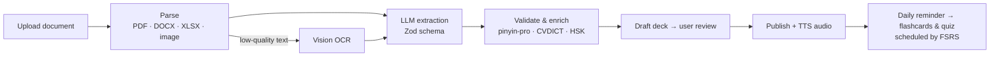
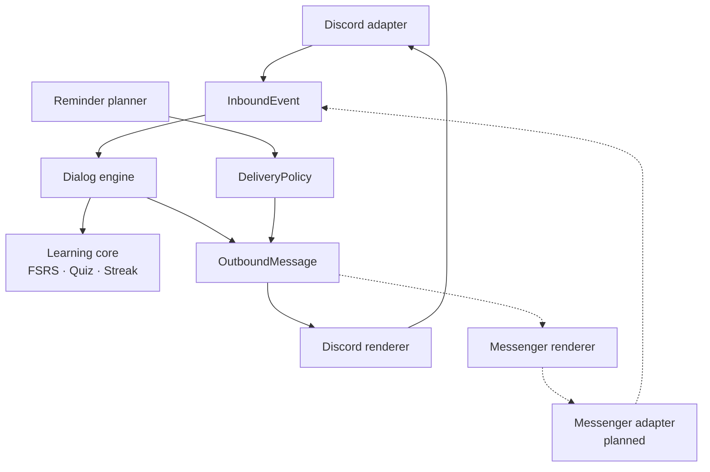

# HanziDaily 汉字

**HanziDaily** is a chatbot for learning Chinese with AI-generated flashcards and daily quizzes. You upload your own study materials (textbooks, vocabulary lists, photos of lessons) and HanziDaily turns them into flashcards: Hanzi, pinyin, Sino-Vietnamese reading, Vietnamese meaning, example sentences, and audio. It then schedules your reviews with spaced repetition (FSRS). You study right inside your chat app.

- **Channel 1 (MVP):** Discord bot, working in DMs and in a community server
- **Channel 2 (planned):** Facebook Messenger and Fanpage
- **Web dashboard:** upload documents, review and edit cards, manage decks, track progress

> **Status:** 🚧 Pre-alpha / planning. See [`PLAN.md`](./PLAN.md) for the roadmap and [`TECHSTACK.md`](./TECHSTACK.md) for the detailed stack.

---

## Table of contents

- [Features](#features)
- [How it works](#how-it-works)
- [Architecture](#architecture)
- [Tech stack](#tech-stack)
- [Repository structure](#repository-structure)
- [Getting started](#getting-started)
- [Environment variables](#environment-variables)
- [Scripts](#scripts)
- [Testing](#testing)
- [Deployment](#deployment)
- [Roadmap](#roadmap)
- [Contributing](#contributing)
- [Data sources & attribution](#data-sources--attribution)
- [License](#license)

---

## Features

### Discord bot (MVP)
| Command | Description |
|---|---|
| `/start` | Create your account and start with a built-in HSK deck |
| `/hoc` | Study flashcards. Flipping edits the card in place; rate each card Again / Hard / Good / Easy |
| `/quiz` | Quick quiz: meaning, pinyin, Hanzi, listen-and-choose, fill-in-the-blank (modal) |
| `/tra <word>` | Look up a word, with autocomplete |
| `/upload` | Upload a PDF / DOCX / XLSX / CSV / image to generate a new deck |
| `/deck` | Select the active deck |
| `/tiendo` | Streak, due cards, quiz accuracy |
| `/caidat` | Reminder time, new cards per day, quiz size |
| `/nhac bat \| tat` | Turn daily DM reminders on or off (opt-in) |
| `/xoadulieu` | Delete your data |

> Commands and bot copy are in Vietnamese because the product targets Vietnamese learners.

### Web dashboard
- Sign in with Discord (Facebook comes later for Messenger)
- Upload documents with 3 extraction modes: **vocabulary list**, **textbook glossary**, **reading passage**
- Review AI-generated cards. Suspicious entries (pinyin mismatch, word not in the dictionary) are flagged and shown first
- Manage decks, study settings and statistics (streak heatmap, accuracy)

### Community server
- `#daily-word` posts
- Weekly streak and points leaderboard
- Onboarding flow that makes sure the bot can DM you

---

## How it works



---

## Architecture

HanziDaily uses a **hexagonal, channel-agnostic** architecture. The learning core (decks, cards, FSRS, quizzes, reminders) and the dialog engine are plain TypeScript. They never import Discord or Meta SDKs. Each chat platform is a **channel adapter**:

- It **normalizes** incoming events into an `InboundEvent`.
- It **renders** abstract `OutboundMessage` UI blocks into platform-native components.
- It applies its own **`DeliveryPolicy`** for proactive messages. Discord: opt-in DMs. Messenger: 24-hour window.



**Architecture rules** (enforced in CI with `dependency-cruiser`):
1. `packages/core`, `packages/dialog` and `packages/channel-kit` must not import `discord.js`, NestJS, Next.js or any channel package.
2. Every UI flow works with the lowest common denominator across channels: ≤ 4 choices, labels ≤ 20 characters, text ≤ 2,000 characters, action payloads ≤ 100 characters.
3. Users are identified by an internal `userId`, never by a channel ID.
4. Every proactive message goes through a `DeliveryPolicy`.

---

## Tech stack

| Layer | Technology |
|---|---|
| Runtime / language | Node.js 24 LTS · TypeScript 6.0 |
| Monorepo / tooling | pnpm · Turborepo · Biome · dependency-cruiser |
| Web | Next.js 16 (App Router, Server Actions) · React 19 · Tailwind CSS 4 · shadcn/ui · TanStack Table & Query |
| Auth | Better Auth (Discord OAuth2, email magic link) |
| Bot & workers | NestJS 12 · discord.js 14 (Components V2) · BullMQ |
| Data | PostgreSQL 18 · Prisma 7 · Redis 8 |
| AI | Vercel AI SDK · Zod · Langfuse (tracing & evals) |
| Chinese NLP | pinyin-pro · `Intl.Segmenter` · CVDICT · CC-CEDICT |
| Learning | ts-fsrs |
| Media & storage | Azure Speech TTS · Cloudflare R2 |
| Infra | Docker Compose · Caddy · GitHub Actions · GHCR |
| Observability | Sentry · pino · Bull Board · BetterStack |
| Testing | Vitest · Testcontainers · Playwright · MSW |

See [`TECHSTACK.md`](./TECHSTACK.md) for pinned versions, rationale, queue design and deployment details.

---

## Repository structure

```
hanzi-daily/
├─ apps/
│  ├─ web/                  # Next.js dashboard (+ /study page for Messenger, planned)
│  ├─ bot/                  # NestJS: Discord gateway, dialog handling, outbound queue (single instance)
│  └─ worker/               # NestJS application context: ingest, media/TTS, reminder planner
├─ packages/              # workspace packages, named @hanzi-daily/<name>
│  ├─ core/                 # Domain: decks, cards, FSRS, quiz generation, streaks, reminder planning
│  ├─ dialog/               # Dialog engine, action codec, Vietnamese copy
│  ├─ channel-kit/          # InboundEvent, OutboundMessage, ChannelAdapter, DeliveryPolicy
│  ├─ channel-discord/      # discord.js adapter, Components V2 renderer, DiscordPolicy
│  ├─ channel-messenger/    # (planned) Graph API adapter, renderer, 24h MessengerPolicy
│  ├─ db/                   # Prisma schema, client, migrations, seeds
│  ├─ ai/                   # LLM adapter, prompts, extractors, eval runner
│  ├─ zh/                   # Pinyin, dictionary lookup, segmentation, Sino-Vietnamese
│  ├─ storage/              # R2 client, presigned URLs, media cache
│  └─ config/               # Env schema, shared tsconfig / Biome presets
├─ tools/seed-dict/         # Import CVDICT / CC-CEDICT / HSK lists into Postgres
├─ fixtures/                # Conversation transcripts, webhook payloads, golden set
├─ infra/                   # docker-compose files, Caddyfile, backup scripts
├─ PLAN.md                  # Product & delivery plan (Vietnamese)
├─ TECHSTACK.md             # Detailed tech stack (Vietnamese)
└─ README.md
```

---

## Getting started

### Prerequisites
- **Node.js 24 LTS**
- **pnpm** (the version is pinned in `package.json` → `packageManager`)
- **Docker** + Docker Compose
- A **Discord application** for development ([Discord Developer Portal](https://discord.com/developers/applications))
- API keys for at least one LLM provider (Anthropic, Google or OpenAI) and Azure Speech (optional in dev)

### 1. Clone and install
```bash
git clone https://github.com/<org>/hanzi-daily.git
cd hanzi-daily
pnpm install
```

### 2. Start local infrastructure
```bash
docker compose -f infra/docker-compose.dev.yml up -d   # postgres:18, redis:8
```

### 3. Configure environment
```bash
cp .env.example .env
# fill in the values — see "Environment variables" below
```

### 4. Set up the Discord application
1. Create an application named **`HanziDaily Dev`** in the Developer Portal.
2. **Bot** tab: create a bot and copy the token into `DISCORD_BOT_TOKEN`. Privileged intents are **not** required.
3. **OAuth2** tab: add the redirect URL `http://localhost:3000/api/auth/callback/discord` and copy the client ID and secret.
4. **Installation** tab: enable **Guild Install** and **User Install**.
5. Invite the bot to your personal test server. Set `DISCORD_COMMUNITY_GUILD_ID` to that server's ID and `DISCORD_COMMAND_SCOPE=guild` so slash commands update instantly.

### 5. Database and seed data
```bash
pnpm db:migrate        # apply Prisma migrations
pnpm seed:dict         # import CVDICT, CC-CEDICT and HSK lists into DictEntry
pnpm seed:decks        # create built-in HSK 1–3 decks
```

### 6. Run everything
```bash
pnpm bot:register      # register slash commands (guild scope in dev)
pnpm dev               # web (http://localhost:3000), bot and worker in watch mode
```

Then type `/start` in your test server or in a DM with the bot.

---

## Environment variables

| Group | Variables |
|---|---|
| Core | `NODE_ENV`, `APP_URL`, `DATABASE_URL`, `REDIS_URL`, `REDIS_CACHE_URL`, `ENCRYPTION_KEY`, `SENTRY_DSN` |
| Auth | `BETTER_AUTH_SECRET`, `BETTER_AUTH_URL`, `DISCORD_CLIENT_ID`, `DISCORD_CLIENT_SECRET` |
| Discord bot | `DISCORD_BOT_TOKEN`, `DISCORD_APP_ID`, `DISCORD_COMMUNITY_GUILD_ID`, `DISCORD_COMMAND_SCOPE` (`guild` \| `global`) |
| Storage | `R2_ACCOUNT_ID`, `R2_ACCESS_KEY_ID`, `R2_SECRET_ACCESS_KEY`, `R2_BUCKET_DOCS`, `R2_BUCKET_MEDIA` |
| AI | `AI_PROVIDER_EXTRACT`, `AI_MODEL_EXTRACT`, `AI_PROVIDER_OCR`, `AI_MODEL_OCR`, `ANTHROPIC_API_KEY`, `GOOGLE_GENERATIVE_AI_API_KEY`, `OPENAI_API_KEY`, `AI_DAILY_BUDGET_USD`, `AI_VISION_ENABLED` |
| Tracing | `LANGFUSE_PUBLIC_KEY`, `LANGFUSE_SECRET_KEY`, `LANGFUSE_BASEURL` |
| Media / email | `AZURE_SPEECH_KEY`, `AZURE_SPEECH_REGION`, `TTS_VOICE`, `RESEND_API_KEY`, `EMAIL_FROM` |
| Messenger (planned) | `META_APP_ID`, `META_APP_SECRET`, `META_VERIFY_TOKEN`, `META_GRAPH_VERSION`, `FACEBOOK_CLIENT_ID`, `FACEBOOK_CLIENT_SECRET`, `STUDY_JWT_SECRET`, `VAPID_PUBLIC_KEY`, `VAPID_PRIVATE_KEY` |

All variables are validated at startup (`@t3-oss/env-core` + Zod). The app refuses to start if a required value is missing.

---

## Scripts

| Command | Description |
|---|---|
| `pnpm dev` | Run web, bot and worker in watch mode (Turborepo) |
| `pnpm build` | Build all apps |
| `pnpm lint` | Biome check (lint + format) |
| `pnpm typecheck` | TypeScript type check across the workspace |
| `pnpm depcheck` | Architecture rules (dependency-cruiser) |
| `pnpm test` | Unit and transcript tests (Vitest) |
| `pnpm test:int` | Integration tests (Testcontainers: Postgres + Redis) |
| `pnpm test:e2e` | Dashboard E2E tests (Playwright) |
| `pnpm ai:eval` | Run the extraction golden set and report quality metrics |
| `pnpm db:migrate` | Create/apply migrations in development |
| `pnpm db:migrate:deploy` | Apply migrations in staging/production |
| `pnpm seed:dict` / `pnpm seed:decks` | Seed dictionary data / built-in decks |
| `pnpm bot:register` | Register Discord slash commands (`DISCORD_COMMAND_SCOPE`) |

---

## Testing

| Level | What we test |
|---|---|
| Unit | FSRS wrapper, quiz and distractor generation, reminder planner, delivery policies, action codec, pinyin utilities |
| Transcript | YAML conversation scripts in `fixtures/transcripts/` run through the dialog engine and snapshot-tested against **every renderer**. Adding a new channel means making the existing transcripts pass. |
| Architecture | `dependency-cruiser` keeps the core free of channel SDKs |
| Integration | Repositories and the ingest pipeline against real Postgres/Redis, with the LLM mocked by MSW |
| Prompt eval | Golden set of real documents. The build fails if pinyin accuracy drops below 98% or recall below 90% |
| E2E | Sign in → upload → review → publish on the dashboard |

---

## Deployment

The MVP runs on a single VPS (Singapore region) with Docker Compose:

| Service | Notes |
|---|---|
| `caddy` | Reverse proxy with automatic TLS |
| `web` | Next.js standalone output |
| `bot` | **Exactly one instance** (one Discord gateway session) |
| `worker` | Can be scaled horizontally |
| `postgres` | Nightly `pg_dump` to R2, monthly restore test |
| `redis` | `appendonly yes`, `maxmemory-policy noeviction` (required by BullMQ) |

**CI/CD (GitHub Actions):**
- **On every PR:** lint → typecheck → architecture check → tests → integration tests (and `ai:eval` when `packages/ai` changes).
- **On push to `main`:** build images → push to GHCR → deploy to **staging** (separate Discord app, `HanziDaily Staging`).
- **On a `v*` tag:** after manual approval, deploy to **production**, run migrations and register global commands.

---

## Roadmap

| Phase | Scope |
|---|---|
| **0 · Spike** | Discord UX spikes, extraction golden set, repo skeleton |
| **1 · Core** | Learning core, ingest pipeline, dashboard |
| **2 · Discord** | Adapter, slash commands, in-place flashcards, quizzes, community server |
| **3 · Beta** | Reminders, hardening, open beta → **Discord launch** |
| **4 · Messenger** | Messenger adapter, 24h delivery policy, `/study` web page, Meta App Review |
| **5 · Growth** | Fanpage automation, AI translation grading, RAG over documents, voice, teacher workspaces, payments |

Details, timelines and go/no-go gates are in [`PLAN.md`](./PLAN.md).

---

## Contributing

- **Branches:** `main` is always deployable. Use `feat/*`, `fix/*`, `chore/*` for work.
- **Commits:** [Conventional Commits](https://www.conventionalcommits.org/) (`feat(bot): add /tra autocomplete`).
- **PRs:** must pass CI. New dialog flows need a transcript fixture. New AI prompts need a version bump and an eval run.
- **Code style:** Biome (no custom formatting debates). Strict TypeScript.
- **Keep the core channel-agnostic.** If you catch yourself importing `discord.js` outside `packages/channel-discord` or `apps/bot`, stop and add an abstraction to `channel-kit`.

---

## Data sources & attribution

HanziDaily uses the following open datasets. Their licenses require attribution, and share-alike applies to redistributed or modified data:

| Dataset | License | Use |
|---|---|---|
| [CVDICT](https://github.com/ph0ngp/CVDICT) (Chinese–Vietnamese dictionary) | CC BY-SA 4.0 | Reference Vietnamese meanings |
| [CC-CEDICT](https://www.mdbg.net/chinese/dictionary?page=cedict) | CC BY-SA 4.0 | Word existence, English glosses |
| HSK vocabulary lists | *check each source's license before use* | HSK levels |
| Noto Sans SC | SIL Open Font License | CJK rendering |

AI-generated content (meanings, examples, Sino-Vietnamese readings) may contain mistakes. Users review every card before it is published.

**Privacy:** user documents are sent to the LLM only to deliver the feature to that user. We send no personal identifiers, and we don't use user data for model training (in line with the Discord Developer Policy and Vietnam's Personal Data Protection Law 91/2025/QH15).

---

## License

TBD. The project is currently private and all rights are reserved until a license is chosen.
