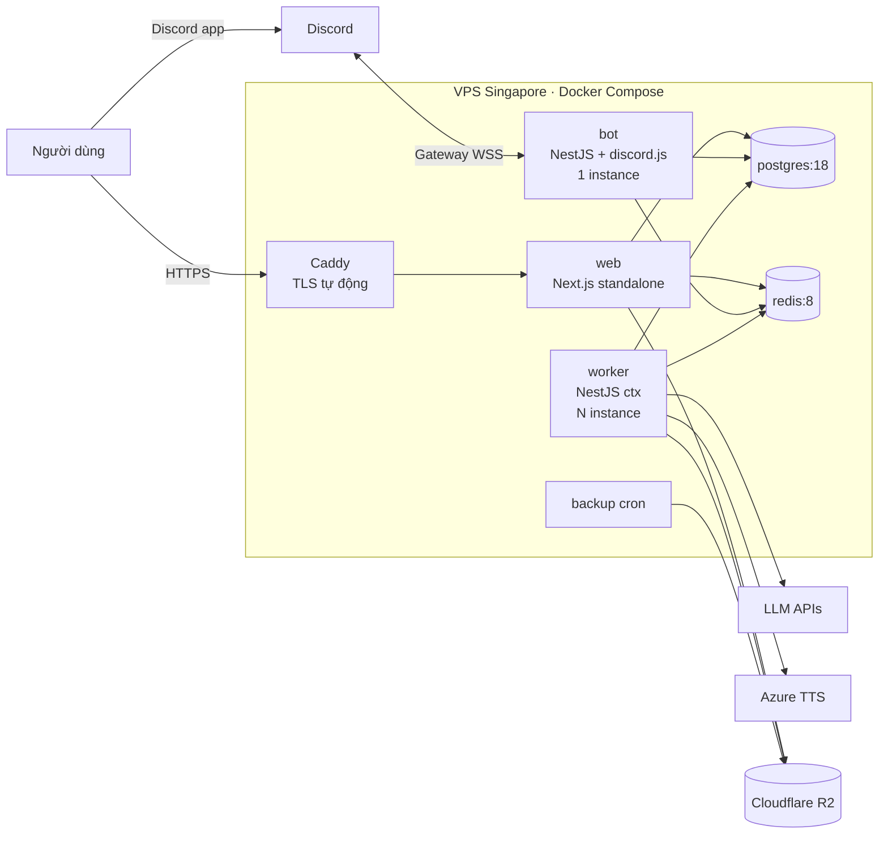

# TECHSTACK — HanziDaily (Discord trước, Messenger sau)

> Tài liệu đi kèm **PLAN.md v3** · Cập nhật: 10/09/2026
> Phiên bản thư viện lấy từ npm registry ngày 10/09/2026. Mọi version ghi ở đây là **mốc khởi đầu đề xuất**, được pin trong lockfile và nâng cấp theo lịch.

---

## 0. Nguyên tắc chọn công nghệ

1. **Một ngôn ngữ duy nhất: TypeScript**, cho web, bot, worker và script dữ liệu. Team 2 người không nên duy trì 2 hệ sinh thái.
2. **Chọn công nghệ “chán mà chắc” (boring tech)**: Postgres, Redis, Docker Compose. Không Kubernetes, Kafka hay microservices ở quy mô < 1.000 user.
3. **Lõi không phụ thuộc kênh và framework**: `packages/core`, `packages/dialog` là TypeScript thuần, không import NestJS, discord.js hay Graph API.
4. **Chỉ dùng bản stable.** Không dùng RC, beta, dev (Prisma 8 RC, discord.js v15 dev).
5. **Nhà cung cấp AI phải thay được**: đi qua 1 adapter, có golden set để so sánh.
6. **Chi phí gần 0 khi chưa có người dùng**: ưu tiên dịch vụ có gói miễn phí hoặc tự host trên 1 VPS.

---

## 1. Bảng tổng quan (pin version)

| Lớp | Công nghệ | Version đề xuất | Vai trò |
|---|---|---|---|
| Runtime | **Node.js LTS** | 24.x (lên 26 LTS sau 10/2026) | Chạy web, bot, worker |
| Ngôn ngữ | **TypeScript** | 6.0.x (thử 7.0 native ở Phase 0) | Xem mục 2.2 |
| Package manager | **pnpm** | 12.x (pin trong `packageManager`) | Workspace monorepo |
| Monorepo | **Turborepo** | 2.10.x | Cache build/test |
| Lint + format | **Biome** | 2.5.x | Thay ESLint + Prettier |
| Luật kiến trúc | **dependency-cruiser** | 18.x | Chặn lõi import SDK kênh |
| Web framework | **Next.js** (App Router) | 16.3.x | Dashboard (+ `/study` Phase 4) |
| UI | **React** 19.x · **Tailwind CSS** 4.3 · **shadcn/ui** (CLI 4.x) · lucide-react · sonner | | |
| Form, bảng | react-hook-form 7.x · **TanStack Table** 9.x · **TanStack Query** 5.x · nuqs 2.x | | Màn hình duyệt thẻ, polling trạng thái |
| Auth | **Better Auth** | 1.7.x | Discord OAuth2, magic link; Facebook ở Phase 4 |
| Backend (bot + worker) | **NestJS** | 12.0.x | DI, module, lifecycle |
| Discord SDK | **discord.js** | 14.27.x (+ discord-api-types) | Gateway, Components V2 |
| Database | **PostgreSQL** | 18.x | Dữ liệu chính |
| ORM | **Prisma** | 7.10.x + `@prisma/adapter-pg` | Schema, migration, client |
| Queue | **BullMQ** (OSS) | 6.3.x + `@nestjs/bullmq` 12 | Job nền, lịch, rate limit |
| Cache/lock | **Redis** 8.x (hoặc Valkey 8.x) | | Queue, state hội thoại, khóa theo user |
| Validation | **Zod** | 4.x | Schema dùng chung API/form/LLM |
| LLM SDK | **Vercel AI SDK** (`ai`) | 7.x + `@ai-sdk/anthropic`, `@ai-sdk/google`, `@ai-sdk/openai` | Đa nhà cung cấp, structured output |
| LLM tracing | **Langfuse** | `@langfuse/tracing` + `@langfuse/otel` 5.x | Trace, chi phí, dataset eval |
| Parse tài liệu | unpdf 1.8 · mammoth 1.12 · **SheetJS CE** (cài từ cdn.sheetjs.com) · papaparse 5.7 · sharp 0.35 · file-type 22 | | PDF/DOCX/XLSX/CSV/ảnh |
| Tiếng Trung | **pinyin-pro** 3.29 · `Intl.Segmenter` · **CVDICT** · CC-CEDICT · opencc-js (phồn thể, Phase 5) · hanzi-writer 3.7 (Phase 4) | | |
| SRS | **ts-fsrs** | 5.4.x | Lịch ôn FSRS |
| TTS | **Azure Speech** (`microsoft-cognitiveservices-speech-sdk` 1.51), dự phòng Google Cloud TTS 7.x | | Audio phát âm |
| Lưu file | **Cloudflare R2** qua `@aws-sdk/client-s3` + `s3-request-presigner` | | Tài liệu, audio |
| Email | **Resend** | 6.x | Nhắc học dự phòng, magic link |
| Thời gian | date-fns 4 + `@date-fns/tz` | | Múi giờ, streak theo ngày |
| Config | `@t3-oss/env-core` + Zod | | Kiểm tra biến môi trường khi khởi động |
| Logging | **pino** 10 + nestjs-pino 5 | | Log JSON |
| Lỗi | **Sentry** (`@sentry/nextjs`, `@sentry/node`) 10.x | | |
| Health | `@nestjs/terminus` 12 | | `/health` cho bot/worker |
| Rate limit | rate-limiter-flexible 11 (dùng Redis) | | Hạn mức AI/upload theo user |
| Test | **Vitest** 5 · **Testcontainers** 12 · **Playwright** 1.63 · MSW 2 | | Unit, integration, E2E |
| Hạ tầng | Docker + Docker Compose · **Caddy** 2 · VPS Singapore | | |
| CI/CD | GitHub Actions + GHCR | | Build image, deploy |
| Uptime | BetterStack (hoặc Uptime Kuma tự host) | | Alert |
| Phase 4 | Graph API client tự viết (fetch/undici) · **jose** 6 (JWT) · **Serwist** 9 (PWA) · web-push 3.6 | | Messenger + trang học |

---

## 2. Runtime & tooling

### 2.1 Node.js 24 LTS
- Là bản LTS đang được hỗ trợ. Node 26 dự kiến lên LTS vào 10/2026, nâng cấp sau khi các thư viện chính xác nhận tương thích.
- Có sẵn `Intl.Segmenter` với full ICU (tách từ tiếng Trung), `fetch`/undici, `node --watch`.
- Docker image: `node:24-bookworm-slim`. Không dùng alpine vì `sharp`, `@napi-rs/canvas` và font CJK trên Debian ổn định hơn.

### 2.2 TypeScript: vì sao chọn 6.0 thay vì 7.0?
- **TS 7.0** (bản native viết lại, phát hành 07/2026) nhanh hơn nhiều, nhưng mới ra. NestJS phụ thuộc `experimentalDecorators` + `emitDecoratorMetadata`, và các tool khác (Next, Biome, Prisma) có thể còn vướng.
- **Quyết định:** dùng TS 6.0.x cho toàn repo. **Build NestJS bằng SWC** (`@nestjs/cli` builder `swc`) để xử lý decorator metadata, không phụ thuộc emit của tsc. Phase 0 spike thử `tsc` 7 chỉ để **typecheck** trong CI. Nếu ổn thì chuyển typecheck sang 7 để tăng tốc.
- `tsconfig` gốc: `strict`, `noUncheckedIndexedAccess`, `moduleResolution: "bundler"`, `verbatimModuleSyntax`.

### 2.3 Monorepo: pnpm + Turborepo
```
hanzi-daily/
├─ apps/
│  ├─ web/            Next.js 16 — dashboard, /study (P4)
│  ├─ bot/            NestJS 12 — Discord gateway + dialog + outbound (1 instance)
│  └─ worker/         NestJS 12 (application context, không HTTP) — ingest, media, planner
├─ packages/
│  ├─ core/           domain thuần TS: deck, card, FSRS, quiz, streak, reminder planner
│  ├─ dialog/         dialog engine, action codec, chuỗi i18n (vi)
│  ├─ channel-kit/    interfaces: InboundEvent, OutboundMessage, ChannelAdapter, DeliveryPolicy
│  ├─ channel-discord/   discord.js adapter + renderer Components V2 + DiscordPolicy
│  ├─ channel-messenger/ (P4) Graph API adapter + renderer + MessengerPolicy
│  ├─ db/             Prisma schema, client, migrations, seed
│  ├─ ai/             LLM adapter, prompts, extractors, eval runner
│  ├─ zh/             pinyin, tra từ điển, tách từ, Hán Việt
│  ├─ storage/        R2 client, presign, MediaCache
│  └─ config/         env schema, tsconfig/biome preset dùng chung
├─ tools/seed-dict/   script import CVDICT/CC-CEDICT/HSK → Postgres
├─ fixtures/          transcripts, payload mẫu, golden set tài liệu
├─ infra/             docker-compose.*.yml, Caddyfile, backup
└─ .github/workflows/
```
- **Internal packages dạng source TS** (không build riêng): Next dùng `transpilePackages`, Nest dùng SWC. Không cần tsup/tsdown ở MVP.
- **Tách `bot` và `worker` thành 2 process:** Gateway Discord chỉ nên có **1 session/1 shard**, nên `bot` luôn đúng 1 instance. `worker` (ingest PDF/Vision tốn CPU/RAM) scale riêng và không làm bot bị giật.

### 2.4 Luật kiến trúc (dependency-cruiser)
```js
// .dependency-cruiser.cjs (rút gọn)
forbidden: [
  { name: 'core-no-channel-sdk',
    from: { path: '^packages/(core|dialog|channel-kit)' },
    to:   { path: 'node_modules/(discord\\.js|discord-api-types|@nestjs|next)' } },
  { name: 'core-no-adapters',
    from: { path: '^packages/(core|dialog)' },
    to:   { path: '^packages/channel-(discord|messenger)' } },
]
```
Chạy trong CI. Vi phạm thì fail build.

---

## 3. Web Dashboard: `apps/web`

| Hạng mục | Lựa chọn | Chi tiết |
|---|---|---|
| Rendering | Next.js 16 App Router, **Server Components** + **Server Actions** | Không có REST riêng cho dashboard. Server Actions gọi Prisma trực tiếp qua `packages/db` |
| Auth | Better Auth + Prisma adapter | Provider **Discord** (scope `identify`, `email` tùy chọn). Session cookie. Bảng `AuthAccount` map `providerAccountId` = Discord user ID → tạo/nối `ChannelIdentity` |
| UI kit | Tailwind 4 + shadcn/ui | Component copy vào repo, tự sửa được |
| Duyệt thẻ | TanStack Table 9 (virtualized) + inline edit + react-hook-form/zod | Thẻ có flag đưa lên đầu, phím tắt duyệt nhanh |
| Trạng thái xử lý | TanStack Query polling 2–3 giây (hoặc SSE) cho `Document.status` | |
| Upload | **Presigned PUT trực tiếp lên R2** → Server Action tạo `Document` → enqueue `ingest` | File không đi qua server web. Kiểm tra `file-type` ở worker |
| URL state | nuqs | Lọc/sắp xếp danh sách thẻ |
| Thống kê | Biểu đồ đơn giản (Recharts hoặc SVG tự vẽ) | Heatmap streak, tỉ lệ đúng |
| Hosting | **Next standalone output trong Docker, cùng VPS** | ⚠️ Vercel Hobby **không cho dùng thương mại**. Nếu dùng Vercel thì phải lên gói Pro |
| i18n | Chỉ tiếng Việt ở MVP, chuỗi đặt trong 1 file | |

---

## 4. Bot service: `apps/bot` + `packages/channel-discord`

### 4.1 Vì sao dùng discord.js trực tiếp mà không dùng Necord?
- Necord (decorator Discord cho NestJS) tiện, nhưng sẽ **gắn adapter Discord vào NestJS**, trái với nguyên tắc adapter độc lập. Necord 7 cũng mới phát hành (01/09/2026) và pin `discord-api-types` ^0.37 trong khi bản hiện tại là 0.38.
- **Quyết định:** `packages/channel-discord` dùng **discord.js 14.27** thuần. `apps/bot` chỉ bọc nó trong 1 Nest provider (`DiscordClientProvider`) để quản lý vòng đời (login, graceful shutdown).

### 4.2 Cấu hình Discord
| Hạng mục | Giá trị |
|---|---|
| Gateway intents | `Guilds`, `DirectMessages`, `GuildMessages`. **Không bật Message Content** (luồng chính dùng slash command, button, modal) |
| Partials | `Channel` (để nhận sự kiện DM) |
| Install contexts | Guild install (server cộng đồng) + User install |
| Đăng ký lệnh | **Dev/staging:** lệnh theo guild (cập nhật tức thì). **Prod:** lệnh global. Script `pnpm bot:register` chạy lúc deploy |
| Components | **Components V2** (Container, Text Display, Section, Media Gallery, Action Row, Button, String Select) + Modal (Text Input, File Upload) |
| Phản hồi | Lệnh nặng thì `deferReply({ flags: Ephemeral })` trong ≤ 3 giây, rồi `editReply`/`followUp` |
| Sharding | 1 shard (discord.js tự quản lý). Chỉ cần tính lại khi vào hàng nghìn server |
| Môi trường | **2 Discord Application riêng**: `HanziDaily Staging` (server test) và `HanziDaily` (prod). Token tách biệt |

### 4.3 Luồng xử lý 1 interaction
```
discord.js event (interactionCreate)
 → normalize → InboundEvent (channel-discord)
 → idempotency: SET NX interaction.id (TTL 15 phút)
 → lock: SET NX lock:user:<userId> (TTL 5 giây, retry 3 lần × 200ms)
 → dialog.handle(state, event)  → { newState, outbound[], effects[] }
 → apply effects (Prisma transaction: CardState, ReviewLog, QuizAttempt…)
 → DiscordRenderer.render(outbound) → interaction.reply / update / showModal
 → lưu state vào Redis (TTL 30 phút), mở lock
```
- **Interaction không đi qua queue** vì hạn 3 giây. Chỉ tin **chủ động** (nhắc học, báo xử lý xong) mới đi qua queue `outbound-discord`.
- **Renderer** đổi `UiBlock` → Components V2: `card` → Container + Text Display (chữ Hán dùng heading `#`), `choices` → Action Row các Button (`custom_id` = action codec ≤ 100 ký tự), `askText` → nút mở Modal, `audio` → file mp3 đính kèm qua File component.

---

## 5. Worker: `apps/worker`

NestJS **application context** (không mở cổng HTTP, chỉ có `/health` qua terminus). Chạy các BullMQ processor:

| Queue | Producer | Concurrency | Retry / Timeout | Ghi chú |
|---|---|---|---|---|
| `ingest` | web, bot (`/upload`) | 2 | 3 lần, exponential backoff · timeout 5 phút | Parse → LLM → validate → Deck nháp |
| `media` | ingest, publish | 4 | 5 lần | TTS + upload R2 + `MediaCache` |
| `reminder-plan` | BullMQ **Job Scheduler** mỗi 5 phút | 1 | — | Quét user cần nhắc → tạo job `outbound` |
| `outbound-discord` | reminder, ingest xong | 2 + **limiter 5 job/giây** | 3 lần. Không retry khi lỗi 50007/50278 | **Consumer nằm ở `apps/bot`** (cần client Discord) |
| `community` | Job Scheduler hằng ngày/tuần | 1 | 3 lần | Đăng #từ-vựng-mỗi-ngày, bảng xếp hạng |
| `maintenance` | Job Scheduler hằng đêm | 1 | — | Dọn state, tổng hợp `DailyStat`, xóa file tạm |
| `outbound-messenger` (P4) | reminder | limiter theo Page | theo mã lỗi Graph | |

- Redis cho BullMQ phải đặt `maxmemory-policy noeviction`. Dùng **2 DB logic** (hoặc 2 instance): `db0` cho queue, `db1` cho cache/state/lock. Cache có thể bị evict mà không ảnh hưởng queue.
- Cài **Bull Board** (UI xem queue) sau Basic Auth ở `/admin/queues`. Chỉ admin truy cập được.

---

## 6. Dữ liệu: PostgreSQL 18 + Prisma 7

| Hạng mục | Lựa chọn |
|---|---|
| Client | Prisma 7.10 + **driver adapter `@prisma/adapter-pg`** (client không dùng Rust engine, nhẹ hơn trong Docker) |
| Migration | `prisma migrate dev` ở local. `prisma migrate deploy` chạy trong **container one-off** trước khi rollout |
| Extension | `pg_trgm` (tìm gần đúng pinyin/nghĩa cho `/tra` autocomplete). `unaccent` (tìm nghĩa tiếng Việt không dấu). `vector` (pgvector, **Phase 5** – RAG) |
| Index quan trọng | `CardState(userId, due)` cho truy vấn “thẻ đến hạn”. `ChannelIdentity(channel, externalUserId, scopeId)` unique. `DictEntry(simplified)`. GIN trigram trên `DictEntry(pinyinPlain, meaningViPlain)` |
| Kiểu dữ liệu | Thời gian lưu `timestamptz` (UTC). `jsonb` cho `Card.extra`, `QuizAttempt.options` |
| Ownership | Mọi repository function nhận `userId` bắt buộc. Có test “không đọc được dữ liệu user khác” |
| Backup | `pg_dump` hằng đêm → R2 (giữ 14 bản ngày + 8 bản tuần). **Thử restore mỗi tháng** |
| Kết nối | Pool 10 cho web, 5 cho bot, 5 cho worker (tổng < `max_connections` 100) |

**Seed dữ liệu từ điển** (`tools/seed-dict`): parse CVDICT (`.u8`), CC-CEDICT, danh sách HSK → bảng `DictEntry` (khoảng 120k dòng, dùng `COPY` cho nhanh). Lưu `source` + `license` từng dòng để hiển thị ghi nguồn.

---

## 7. AI / LLM

### 7.1 Kiến trúc
```
packages/ai
├─ adapter.ts        // chọn provider/model theo "task", đọc từ config
├─ tasks/
│  ├─ extract-vocab.ts      // text → Card[] (zod schema)
│  ├─ ocr-page.ts           // ảnh trang → text/markdown (vision)
│  ├─ classify-intent.ts    // fallback intent (rẻ nhất)
│  └─ grade-translation.ts  // Phase 5
├─ prompts/          // prompt có version: extract-vocab.v3.md …
├─ guards/           // hạn mức, cắt input, loại PII
└─ eval/             // chạy golden set, xuất báo cáo, gate CI
```
- Dùng **Vercel AI SDK 7** với structured output theo **schema Zod**. Output sai schema → retry 1 lần với thông báo lỗi → vẫn sai thì đánh dấu chunk lỗi, không làm hỏng cả tài liệu.
- **Model theo task** (quyết định cuối cùng dựa trên golden set ở Phase 0):

| Task | Loại model | Ứng viên | Lý do |
|---|---|---|---|
| Trích xuất từ vựng từ text | Nhỏ, rẻ, JSON tốt | Claude Haiku · Gemini Flash · GPT mini | Chạy nhiều nhất |
| OCR trang/ảnh tiếng Trung | Vision tốt với CJK | Gemini Flash · Claude Haiku/Sonnet | Chi phí/trang thấp, chữ Hán dày đặc |
| Phân loại intent (fallback) | Rẻ nhất | Model nhỏ nhất của provider đang dùng | Hiếm khi gọi |
| Chấm câu dịch (P5) | Tầm trung | Claude Sonnet · Gemini Pro | Cần giải thích ngữ pháp |

- **Kiểm soát chi phí:** ghi `AiUsage` sau mỗi lần gọi (token in/out, model, USD ước tính). Hạn mức theo user bằng rate-limiter-flexible. Có **kill-switch** qua biến môi trường để tắt Vision khi vượt ngân sách ngày.
- **Quyền riêng tư:** chỉ gửi nội dung tài liệu, không gửi tên, email hay Discord ID. Dùng API key doanh nghiệp, cấu hình **không dùng dữ liệu để train** (đồng thời tuân thủ Discord Developer Policy).
- **Langfuse:** trace mọi lần gọi (OTel). Golden set lưu thành Langfuse Dataset. CI chạy eval khi `packages/ai/**` thay đổi, và chạy hằng đêm.

### 7.2 Pipeline parse tài liệu
| Loại file | Thư viện | Ghi chú |
|---|---|---|
| PDF có text | **unpdf** (pdf.js) | Kiểm tra chất lượng: tỉ lệ ký tự CJK hợp lệ, số ký tự lạ → kém thì sang Vision |
| PDF scan / lỗi font | unpdf render trang → `@napi-rs/canvas` → PNG → **sharp** (resize ≤ 1600px, grayscale) → Vision | Giới hạn 30 trang/ngày/user |
| DOCX | **mammoth** (sang HTML/text, giữ bảng) | |
| XLSX | **SheetJS CE** cài từ `cdn.sheetjs.com` | ⚠️ Gói `xlsx` trên npm (0.18.5) đã cũ và có lỗ hổng. Không dùng |
| CSV | **papaparse** | Tự nhận delimiter, encoding UTF-8/UTF-16 |
| Ảnh JPG/PNG | sharp → Vision | |
| Kiểm tra MIME thật | **file-type** | Không tin phần mở rộng file |

---

## 8. Xử lý tiếng Trung: `packages/zh`

| Chức năng | Công cụ | Ghi chú |
|---|---|---|
| Sinh/kiểm tra pinyin | **pinyin-pro** 3.29 | Có ngữ cảnh cho chữ đa âm. Lệch với LLM thì gắn flag |
| Tách từ | `Intl.Segmenter('zh', { granularity: 'word' })` | Có sẵn trong Node, không cần native addon (nodejieba) |
| Nghĩa tiếng Việt tham chiếu | **CVDICT** (~122k mục, CC BY-SA 4.0) | Được dịch máy nên chỉ để tham chiếu |
| Nghĩa tiếng Anh, kiểm tra từ tồn tại | **CC-CEDICT** (CC BY-SA 4.0) | |
| Cấp độ HSK | Danh sách HSK mã nguồn mở | ⚠️ Kiểm tra license từng nguồn trước khi dùng |
| Hán Việt | Bảng âm Hán Việt theo chữ + CVDICT | Nhiều âm/chữ nên để mức “tham khảo” |
| Phồn thể (P5) | opencc-js | |
| Thứ tự nét (P4, trang học) | hanzi-writer | Hiển thị trên web |
| Pinyin không dấu để tìm kiếm | Hàm tự viết (bỏ dấu thanh, `ü→v`) | Cho `/tra` autocomplete |

---

## 9. Media & lưu trữ

| Hạng mục | Lựa chọn | Chi tiết |
|---|---|---|
| TTS chính | **Azure Speech** (giọng neural zh-CN) | Xuất `audio-24khz-48kbitrate-mono-mp3`. Có gói miễn phí hằng tháng (kiểm tra hạn mức hiện tại) |
| TTS dự phòng | Google Cloud TTS | Đổi được qua config |
| Cache | Khóa `sha1(hanzi + pinyin + voice)` → `r2://media/tts/<hash>.mp3` | Deck HSK tạo trước toàn bộ khi seed |
| Lưu file | **Cloudflare R2**, bucket `docs` (private) và `media` (private + URL ký ngắn hạn) | Không mất phí egress |
| Attachment Discord | Tải về R2 **ngay khi nhận** | URL CDN của Discord có hạn |
| Vòng đời | Xóa file gốc 90 ngày sau khi xử lý xong (tùy chọn trong Terms) · xóa ngay khi user xóa dữ liệu | Tối thiểu hóa dữ liệu |

---

## 10. Bảo mật

| Hạng mục | Cách làm |
|---|---|
| Secrets | `.env` trên server (quyền 600), không commit. Kiểm tra bằng `@t3-oss/env-core` khi khởi động. Nâng cấp sau: Infisical/Doppler |
| Mã hóa token lưu DB | AES-256-GCM (`node:crypto`), khóa `ENCRYPTION_KEY` riêng. Dùng cho Page token ở Phase 4 |
| Web | Better Auth cookie `httpOnly`, `secure`, `sameSite=lax`. CSRF cho Server Actions do Next xử lý. Header bảo mật đặt ở Caddy |
| Upload | Presigned URL hết hạn 5 phút, giới hạn `Content-Length`. Kiểm tra `file-type`. Không bao giờ thực thi file |
| Discord | Token bot chỉ nằm ở `apps/bot`. Nếu sau này chuyển sang HTTP interactions thì phải xác thực chữ ký **Ed25519** |
| Messenger (P4) | Xác thực `X-Hub-Signature-256` (HMAC-SHA256 + `timingSafeEqual`), NestJS bật `rawBody: true` |
| Prompt injection | Output LLM đi qua schema Zod + đối chiếu từ điển. LLM không có quyền gọi tool hay truy cập DB |
| Phụ thuộc | Renovate (PR nâng version hằng tuần) + `pnpm audit` trong CI |

---

## 11. Quan sát hệ thống (observability)

| Tín hiệu | Công cụ | Cảnh báo |
|---|---|---|
| Log | pino (JSON) → `docker logs`; nâng cấp: BetterStack Logs/Loki | — |
| Lỗi | Sentry (web + bot + worker), tag theo `channel`, `task` | Lỗi mới, lỗi tăng đột biến |
| LLM | Langfuse | Chi phí/ngày > ngưỡng, tỉ lệ lỗi schema > 5% |
| Queue | Bull Board + metric tự đẩy (job chờ, job lỗi) | Backlog `ingest` > 50, `outbound` > 200 |
| Discord | Sự kiện `shardDisconnect`/`shardReconnecting`, tỉ lệ lỗi DM | Mất Gateway > 2 phút, lỗi DM > 5% |
| Uptime | BetterStack ping `/health` của web, bot, worker | Down > 1 phút |

---

## 12. Kiểm thử

| Loại | Công cụ | Nội dung |
|---|---|---|
| Unit | **Vitest 5** | `core` (FSRS, quiz, planner, DeliveryPolicy), `zh`, action codec |
| Transcript / snapshot | Vitest + `fixtures/transcripts/*.yaml` | Chạy hội thoại qua dialog engine → snapshot từng renderer (Discord; Messenger ở P4) |
| Kiến trúc | dependency-cruiser | Lõi không import SDK |
| Integration | **Testcontainers 12** (Postgres 18, Redis 8) | Repository, ingest end-to-end với LLM mock (MSW) |
| Prompt eval | Langfuse Datasets + script `pnpm ai:eval` | Gate chất lượng (pinyin ≥ 98%, recall ≥ 90%) |
| E2E web | **Playwright 1.63** | Đăng nhập (mock OAuth), upload, duyệt, publish |
| Thủ công | Checklist trên Discord desktop/iOS/Android | Mỗi release |

---

## 13. Hạ tầng & triển khai

### 13.1 Sơ đồ triển khai (MVP)



### 13.2 Cấu hình máy
- **MVP:** VPS 2 vCPU / 4GB RAM / 80GB SSD, vùng **Singapore** (DigitalOcean, Vultr, Hetzner…). Ước tính RAM: web ~400MB · bot ~250MB · worker ~400MB (có lúc tăng khi render PDF) · Postgres ~600MB · Redis ~100MB. Bật swap 2GB.
- **Khi cần nâng:** 4 vCPU / 8GB, hoặc tách Postgres sang dịch vụ managed (Neon/Supabase/DO Managed).

### 13.3 docker-compose (rút gọn)
```yaml
services:
  caddy:   { image: caddy:2, ports: ["80:80","443:443"], volumes: ["./Caddyfile:/etc/caddy/Caddyfile", "caddy_data:/data"] }
  web:     { image: ghcr.io/<org>/hanzi-daily-web:${TAG}, env_file: .env, depends_on: [postgres, redis] }
  bot:     { image: ghcr.io/<org>/hanzi-daily-bot:${TAG}, env_file: .env, deploy: { replicas: 1 } }
  worker:  { image: ghcr.io/<org>/hanzi-daily-worker:${TAG}, env_file: .env, deploy: { replicas: 1 } }
  migrate: { image: ghcr.io/<org>/hanzi-daily-worker:${TAG}, command: ["pnpm","db:migrate:deploy"], profiles: ["ops"] }
  postgres:
    image: postgres:18
    volumes: ["pg_data:/var/lib/postgresql"]
    environment: { POSTGRES_PASSWORD: ${PG_PASSWORD} }
  redis:
    image: redis:8
    command: ["redis-server","--appendonly","yes","--maxmemory-policy","noeviction"]
    volumes: ["redis_data:/data"]
volumes: { caddy_data: {}, pg_data: {}, redis_data: {} }
```

### 13.4 CI/CD (GitHub Actions)
```
PR:    biome check → tsc (typecheck) → depcruise → vitest (unit + transcript)
       → integration (testcontainers) → [nếu đổi packages/ai] ai:eval
main:  build 3 image (web, bot, worker) → push GHCR (tag = git sha)
       → deploy STAGING (SSH: compose pull → run migrate → up -d) → smoke test
       → đăng ký lệnh guild staging
tag v*: bấm duyệt tay → deploy PROD → đăng ký lệnh global → Sentry release
```
- Có thể dùng **Dokploy/Coolify** để có UI deploy cho team nhỏ. Mặc định là SSH + compose cho đơn giản.
- **Staging** chạy chung VPS nhưng khác compose project, khác DB và khác Discord Application.

### 13.5 Biến môi trường
```
# chung
NODE_ENV, DATABASE_URL, REDIS_URL, REDIS_CACHE_URL, ENCRYPTION_KEY, SENTRY_DSN, APP_URL
# auth / web
BETTER_AUTH_SECRET, BETTER_AUTH_URL, DISCORD_CLIENT_ID, DISCORD_CLIENT_SECRET
# bot
DISCORD_BOT_TOKEN, DISCORD_APP_ID, DISCORD_COMMUNITY_GUILD_ID, DISCORD_COMMAND_SCOPE=guild|global
# storage
R2_ACCOUNT_ID, R2_ACCESS_KEY_ID, R2_SECRET_ACCESS_KEY, R2_BUCKET_DOCS, R2_BUCKET_MEDIA
# AI
AI_PROVIDER_EXTRACT, AI_MODEL_EXTRACT, AI_PROVIDER_OCR, AI_MODEL_OCR,
ANTHROPIC_API_KEY, GOOGLE_GENERATIVE_AI_API_KEY, OPENAI_API_KEY, AI_DAILY_BUDGET_USD, AI_VISION_ENABLED
LANGFUSE_PUBLIC_KEY, LANGFUSE_SECRET_KEY, LANGFUSE_BASEURL
# media / email
AZURE_SPEECH_KEY, AZURE_SPEECH_REGION, TTS_VOICE=zh-CN-XiaoxiaoNeural, RESEND_API_KEY, EMAIL_FROM
# Phase 4 – Messenger
META_APP_ID, META_APP_SECRET, META_VERIFY_TOKEN, META_GRAPH_VERSION, FACEBOOK_CLIENT_ID, FACEBOOK_CLIENT_SECRET, STUDY_JWT_SECRET, VAPID_PUBLIC_KEY, VAPID_PRIVATE_KEY
```

---

## 14. Phần bổ sung cho Phase 4 (Messenger)

| Thành phần | Lựa chọn | Ghi chú |
|---|---|---|
| Webhook | Controller trong `apps/bot` (NestJS, `rawBody: true`) | Stateless, trả 200 ngay, enqueue `inbound-messenger` |
| Graph API client | Tự viết bằng `fetch` (undici), **pin `META_GRAPH_VERSION`** | Send API, Attachment Upload (`is_reusable`), Messenger Profile API |
| Adapter | `packages/channel-messenger` | Renderer: `choices` → quick replies, `replace` lùi về `new`, `askText` → chờ tin text |
| Policy | `MessengerPolicy` (thuật toán 24h của v2) | Unit test mốc biên |
| Liên kết | Better Auth provider **Facebook** + `m.me/<page>?ref=<LinkToken>` | |
| Trang học | Next `/study` + **jose** (JWT 30 phút) + **hanzi-writer** + **Serwist** (PWA) + **web-push** | Nhắc dự phòng qua Web Push |
| Tuân thủ | Data Deletion Callback endpoint, Privacy URL trong App | Phục vụ App Review |

---

## 15. Những thứ CỐ Ý không dùng

| Không dùng | Lý do |
|---|---|
| LangChain / LangGraph | Luồng chủ yếu là flashcard/quiz có cấu trúc. Chỉ vài task LLM đơn lẻ, AI SDK + Zod là đủ và dễ debug hơn |
| MongoDB | Dữ liệu học tập mang tính quan hệ (user–deck–card–review), truy vấn “đến hạn” cần index tốt |
| Kubernetes, microservices, Kafka | Quá tải vận hành với 2 dev và < 1.000 user |
| BullMQ Pro (Groups) | Trả phí. Khóa Redis theo user là đủ |
| Necord | Gắn adapter Discord vào NestJS (xem 4.1) |
| Vercel Hobby | Không cho dùng thương mại |
| Gói `xlsx` trên npm | Cũ, có lỗ hổng. Dùng SheetJS CE từ CDN chính thức |
| Prisma 8 RC, discord.js v15 dev | Chưa stable |
| nodejieba | Native addon, khó build. `Intl.Segmenter` đủ cho MVP |
| Messenger Extensions SDK | Tình trạng hỗ trợ không rõ ràng. Dùng URL button + JWT |

---

## 16. Rủi ro tương thích & checklist spike (Phase 0)

| Hạng mục | Rủi ro | Cách kiểm tra | Phương án dự phòng |
|---|---|---|---|
| NestJS 12 (ra 27/08/2026) | Còn mới, có thể gặp lỗi của bản đầu | Dựng khung bot + worker + bullmq + pino, chạy 1 tuần ở staging | Dùng NestJS 11.x (các module đều hỗ trợ cả 11 và 12) |
| TypeScript 7 native | Decorator, plugin tool | `tsc` 7 typecheck toàn repo trong CI (job không bắt buộc pass) | Giữ TS 6.0 |
| Prisma 7 + adapter-pg | Khác cách cấu hình so với Prisma 5/6 | Migrate + seed 120k dòng DictEntry | Drizzle ORM |
| Components V2 trên mobile | Hiển thị khác nhau giữa các client | Test flashcard trên iOS/Android/desktop | Dùng Embed + Button kiểu cũ |
| DM khi user-install | Không chung server thì có thể không DM được | Thử 2 kịch bản | Bắt buộc vào server cộng đồng |
| Vision OCR tiếng Trung | Chất lượng/chi phí | Golden set 20–30 tài liệu | Tesseract `chi_sim` + LLM sửa lỗi |
| Font CJK trong container | Render PDF → ảnh bị ô vuông | Cài `fonts-noto-cjk` trong image worker | — |

---

## 17. Bắt đầu nhanh (khung repo)

```bash
# 1. Khởi tạo
pnpm dlx create-turbo@latest hanzi-daily --package-manager pnpm
cd hanzi-daily && pnpm add -Dw @biomejs/biome dependency-cruiser typescript@~6.0 vitest

# 2. Apps
pnpm dlx create-next-app@16 apps/web --ts --tailwind --app --src-dir --use-pnpm
pnpm dlx @nestjs/cli@12 new apps/bot --package-manager pnpm --skip-git
pnpm dlx @nestjs/cli@12 new apps/worker --package-manager pnpm --skip-git

# 3. Thư viện chính
pnpm --filter bot add discord.js@^14.27 @nestjs/bullmq bullmq ioredis nestjs-pino pino pino-http @nestjs/terminus
pnpm --filter worker add @nestjs/bullmq bullmq ioredis unpdf mammoth papaparse sharp file-type \
  ai @ai-sdk/anthropic @ai-sdk/google microsoft-cognitiveservices-speech-sdk @aws-sdk/client-s3
pnpm --filter web add better-auth @tanstack/react-query @tanstack/react-table react-hook-form zod nuqs
pnpm --filter @hanzi-daily/db add @prisma/client@^7.10 @prisma/adapter-pg pg && pnpm --filter @hanzi-daily/db add -D prisma@^7.10
pnpm --filter @hanzi-daily/core add ts-fsrs date-fns @date-fns/tz zod
pnpm --filter @hanzi-daily/zh add pinyin-pro

# 4. Hạ tầng local
docker compose -f infra/docker-compose.dev.yml up -d   # postgres:18, redis:8
pnpm db:migrate && pnpm seed:dict && pnpm dev
```

> Lưu ý: cài `prisma@^7.10` **có chỉ định version**, vì tag `latest` trên npm của Prisma đang trỏ tới bản 8 RC.
